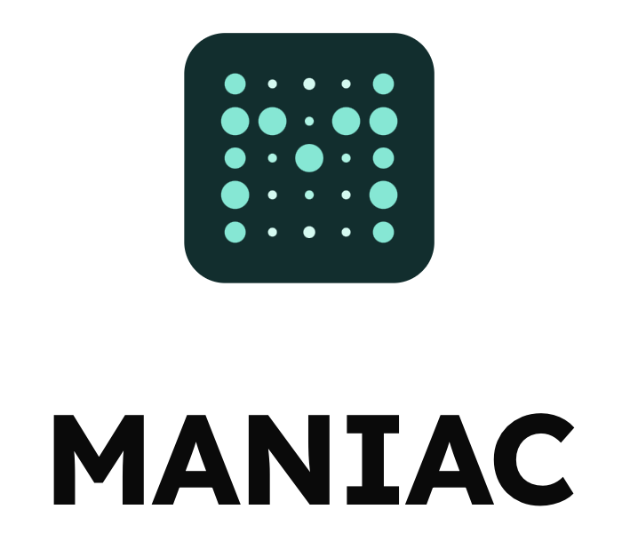
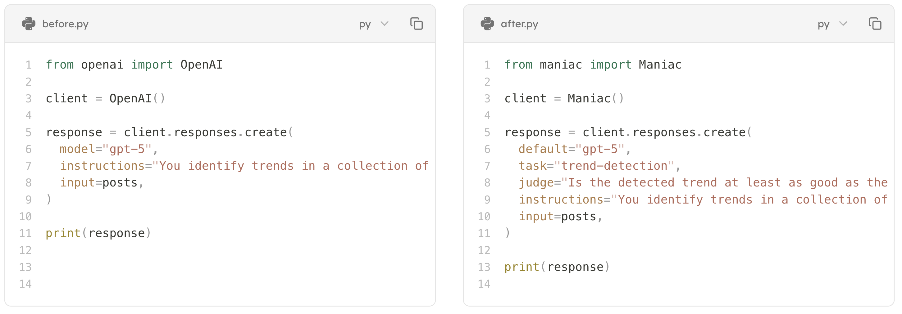

  

# Self-Improving, Model-Agnostic Containers for Packaging State-of-the-Art AI Agents

Welcome to Maniac, the open-source platform that makes it easy to continually optimize state-of-the-art AI agents. With just 3 lines of code, Maniac brings the power of containerization and orchestration to the world of AI, letting you package any task into a self-improving, portable container that runs on any model, anywhere. With Maniac, you never have to worry about being locked into a single model vendor or being forced to upgrade to a new model just to get access to new features; your containers evaluate and optimize for you.

## Core Analogy: Kubernetes

In modern software development, Kubernetes allows you to package an application and its dependencies into a single, portable container that can be deployed on any server, in any cloud. This eliminates vendor lock-in and provides massive scalability.

Maniac applies this same revolutionary concept to AI. Instead of building your application for a single, monolithic AI model (like GPT-4 or Claude 3), Maniac lets you package your AI-driven task into a portable **Model Container**.

## What is a Model Container?

A Model Container is a self-contained package that holds everything your AI agent needs to perform its task. Think of it as an abstract, model-agnostic program (much like in DSPy) that can be deployed across any supported Large Language Model, ensuring your agent always has access to the best tools for the job. 

Each container bundles:

- **Task-Specific LoRAs**: Lightweight, fine-tuned adapters that make any base model an expert on your specific task.
- **Optimized Prompts**: A set of prompts that are individually optimized for different models, ensuring the best performance no matter where the container is deployed.
- **System Prompt**: The core instructions that define the task and the AI's persona or objective.
- **Judge Prompt**: A specialized prompt used to evaluate the model's output, enabling continuous, automated quality control.

## How It Works

  

The Maniac ecosystem is composed of two key services: always on, automatically optimizing using your live production data:

1.  **Container Factory**: This service auto-trains LoRAs and auto-optimizes the prompts within a container to ensure they are maximally effective for each target model on the container task.
2.  **Control Plane**: This service intelligently deploys Model Containers to the best-suited model from a cluster of available options. It constantly evaluates model performance and routes tasks dynamically, ensuring your application always runs on the most effective and efficient infrastructure.

By decoupling the AI task from the underlying model, Maniac empowers you to build applications that are:

- **Model-Agnostic**: Swap models in and out without changing your application code.
- **Future-Proof**: Seamlessly integrate new, state-of-the-art models as they become available.
- **Cost-Effective**: Route tasks to the most cost-efficient model that meets your performance requirements.
- **Highly Performant**: Automatically use the best-performing model for every task, every time.

This documentation will guide you through the Maniac architecture and show you how to start building your own powerful, model-agnostic AI agents.
